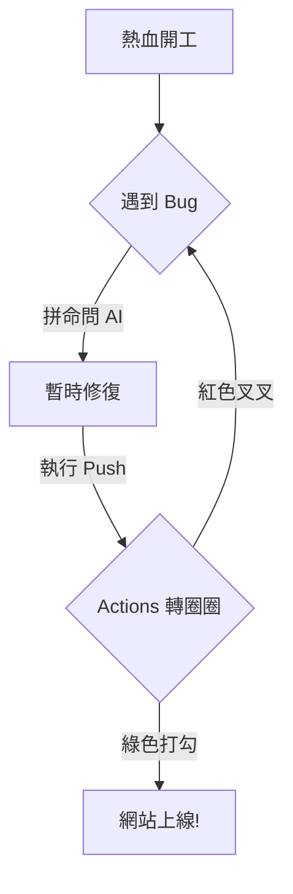

## 🚧 數位重置：為什麼我要蓋這個網站？

這一切都始於 **「2026 帳本重置計畫」**。在清理完實體書桌與數位垃圾後，我發現我需要一個真正的「數位門面」。

以前覺得統計推論裡的 **Basu 定理** 很難，要證明充分性（Sufficiency）與輔助性（Ancillarity）的獨立性需要極度嚴謹的邏輯。但現在我發現，**Git 的連動邏輯**才是真正的哲學難題。

### 核心痛點：
* **本地 (Local) vs. 雲端 (GitHub)**：為什麼我改了東西還要「發車」 (Push)？
* **模板 (Template)**：為什麼改個選單要去改 `src/config.ts`？
* **環境 (Environment)**：那些 `pnpm` 和 `astro` 的報錯訊息，比 Econometrics 的異方差問題還要難搞。

---

## 🧪 功能測試：我的工具箱還活著嗎？

既然這是一個專業研究生的網站，我必須測試一下我的武裝：

### 1. 數學公式 (KaTeX)
Basu 定理告訴我們，若 $T$ 是完全充分統計量，而 $A$ 是輔助統計量，則兩者獨立：
$$T \perp A$$
這代表資訊的「精華」與「雜訊」在某種定義下是完全切分的。這對於我們理解數據分佈至關重要。

### 2. 邏輯流程 (Mermaid)
測試主題內置的 Mermaid 支援：



3. 代碼區塊 (Expressive Code)測試代碼高亮與折疊功能：TypeScript// 這是我的 config.ts 核心設定片段
```bash
export default {
  site: {
    title: "Dingding 真棒！",
    author: "A Cup of Chamomile Tea Latte",
    language: "zh-TW"
  },
  sidebar: {
    avatar: "/images/avatar0.png",
    position: "left"
  }
};
```

🏁 結論正如我在學習 分位數迴歸 (QR) 時發現的，$L_1$ 損失只能抓出一個點，但我們要的是整個分佈。這個網頁現在也只是一個點，希望未來它能長成一個完整的知識分佈。研究生做網站，真的好難。
---

### 下一步建議

1.  **存檔後預覽**：回到 `localhost:4321`，看看這篇文章的**公式**和**流程圖**有沒有正確顯示。
2.  **正式上線**：確認沒問題後，執行那套「發車指令」：
    * `git add .`
    * `git commit -m "feat: 發表第一篇測試文章"`
    * `git push`

**上傳後，想讓我陪你一起確認網頁上的 Mermaid 流程圖有沒有跑版嗎？**