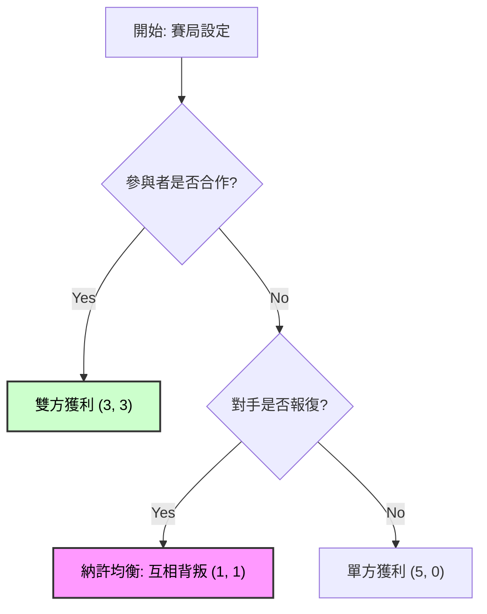

import { Grid, GridCell } from "../components/mdx/Grid";

## 1. 文字排版 (Typography)

### 標題與段落

這是第一段（不縮排）。身為經濟學研究生，排版的一致性與數據的精準度同樣重要。這段文字展示了 **Inter** 作為內文的易讀性。

這是第二段（自動縮排 2em）。你會發現這個段落的首行自動往後推了。這種智慧縮排模組能讓長篇的學術論述看起來更有條理，模擬了 LaTeX 的標準行為。

### 強調與變化

- **粗體 (Bold)**：這是 **重要的變數**。
- *斜體 (Italic)*：這是 *ceteris paribus* (其他條件不變)。
- **刪除線 (Strikethrough)**：~~這是錯誤的假設~~。
- **高亮 (Highlight)**：這是 <mark>預設的高亮重點</mark>，顏色已調整為柔和黃。

### 顏色與大小 (HTML 混寫)

如果你需要更精細的控制，可以直接使用 HTML 標籤（Obsidian 支援）：

- 這是紅色的警示文字
- 這是綠色的通過訊號
- 這是一行比較小的灰色註解 (Small Caption)，適合用在補充說明。

---

## 2. 數學公式 (Math / KaTeX)

### 行內公式 (Inline)

根據定義，我們知道 $\lim_{x \to 0} (1+x)^{1/x} = e$。此外，通貨膨脹率 $\pi_t$ 與失業率 $u_t$ 的關係至關重要。

### 區塊公式 (Block)

當我們考慮一個標準的 OLS 回歸模型：

$$
Y_i = \beta_0 + \beta_1 X_{1i} + \beta_2 X_{2i} + \epsilon_i
$$

其中干擾項 $\epsilon_i$ 服從常態分配：

$$
\epsilon_i \sim \mathcal{N}(0, \sigma^2)
$$

---

## 3. 表格樣式 (Tables)

### 樣式 A：標準 Markdown 表格 (預設)

| ID | Name | Role | Access Level |
| :--- | :--- | :--- | :--- |
| 001 | DingDing | Researcher | Admin |
| 002 | Gemini | Assistant | Editor |

### 樣式 B：學術三線表 (Booktabs Style)

| Variable | Coefficient | Std. Error | t-Statistic | P-Value |
| :--- | :--- | :--- | :--- | :--- |
| Constant | 0.542*** | (0.045) | 12.04 | 0.000 |
| GDP_Growth | 1.205** | (0.512) | 2.35 | 0.019 |
| Inflation | -0.034 | (0.102) | -0.33 | 0.741 |

*Note: *** p<0.01, ** p<0.05, * p<0.1*

---

## 4. 圖片與佈局 (Images & Layouts)

### 單張圖片 (自動置中 + 說明)

<figure>
  
  <figcaption>圖 1：這是單張圖片的標準展示，CSS 會自動將圖片置中，並將說明文字設為斜體灰色。</figcaption>
</figure>

### 多圖並列 (Facet / Grid)

<Grid col={2}>
  <GridCell>
    
    
Panel A: Time Series Trend

  </GridCell>
  <GridCell>
    
    
Panel B: Residual Distribution

  </GridCell>
</Grid>

---

## 5. 邏輯流程圖 (Mermaid)

### 經濟模型流程 (Flowchart)

## 6. 提示區塊 (Callouts / Admonitions)

### 資訊提示 (Info)

<AlertBlockquote type="info" title="定理 1 (Theorem)">

若 $f(x)$ 在 $[a, b]$ 上連續，則存在 $c \in (a, b)$ 使得 $f'(c) = \dfrac{f(b)-f(a)}{b-a}$。

</AlertBlockquote>

### 警告提示 (Warning)

<AlertBlockquote type="warning" title="假設 (Assumption)">

模型假設誤差項具有同質變異數 (Homoscedasticity)，否則標準誤估計將有偏。

</AlertBlockquote>

### 危險提示 (Danger)

<AlertBlockquote type="danger" title="注意 (Note)">

請勿在沒有備份的情況下執行 `rm -rf /`。

</AlertBlockquote>

### 成功提示 (Tip)

<AlertBlockquote type="tip" title="結論 (Conclusion)">

我們的模型在 95% 信心水準下顯著拒絕虛無假設，證明了變數之間的正相關性。

</AlertBlockquote>